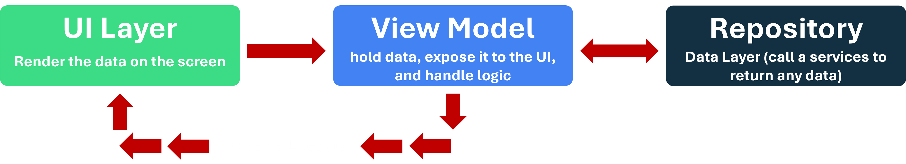
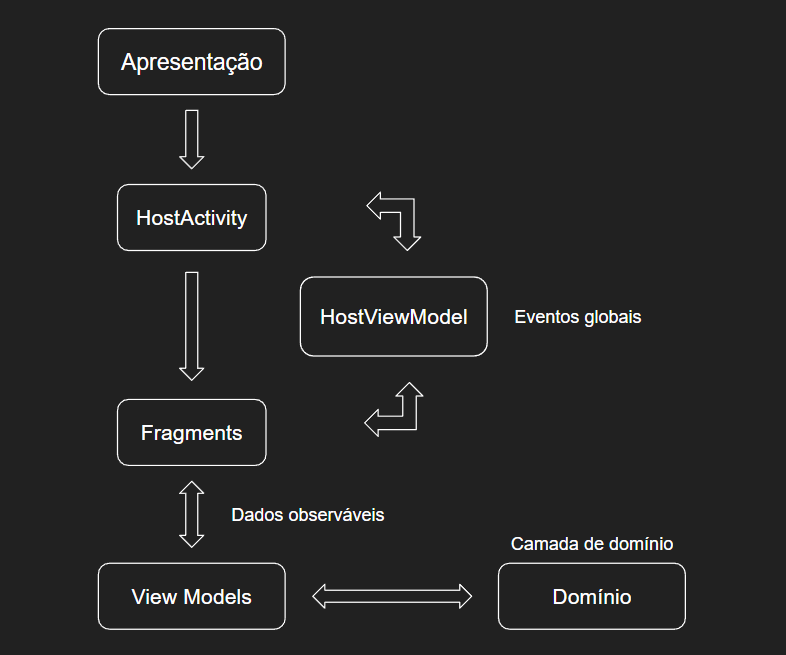
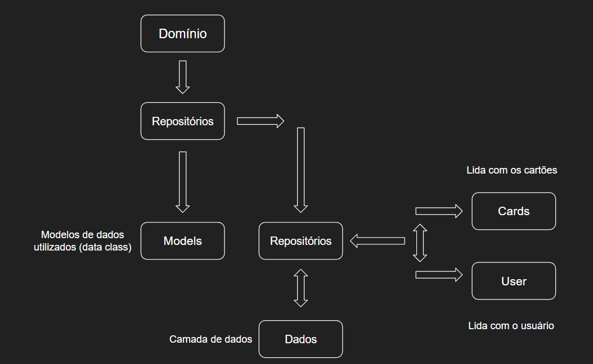
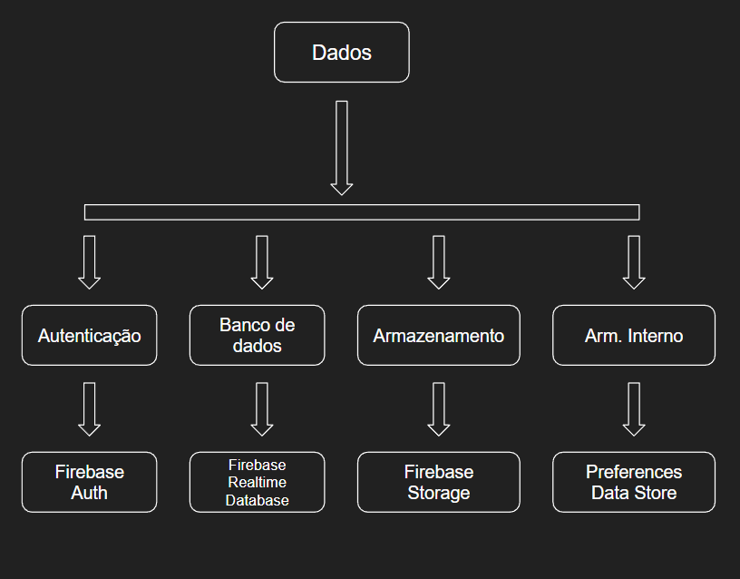
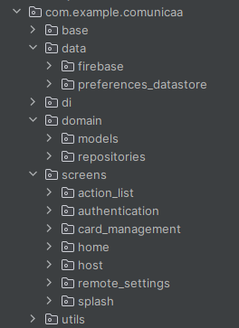
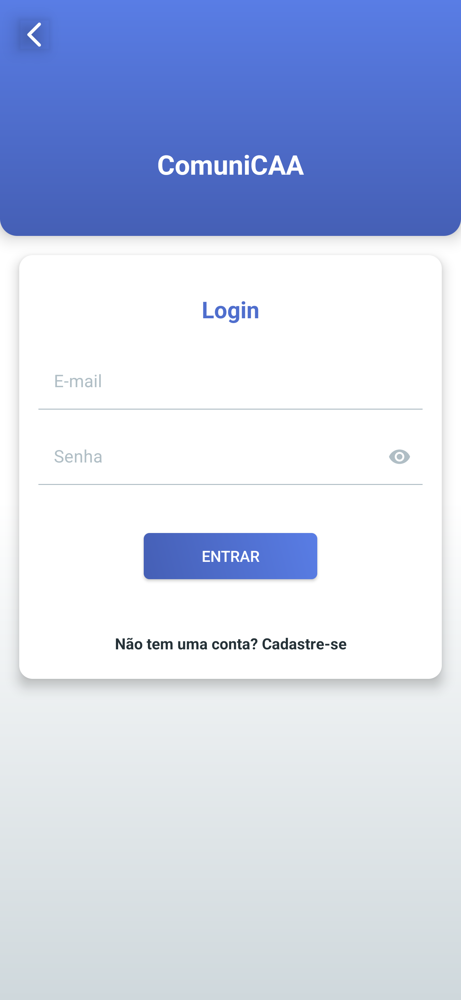
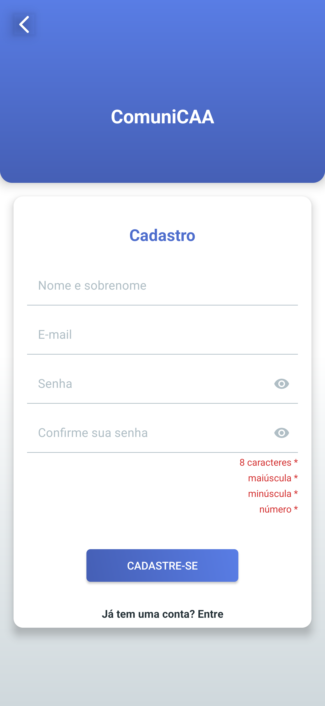
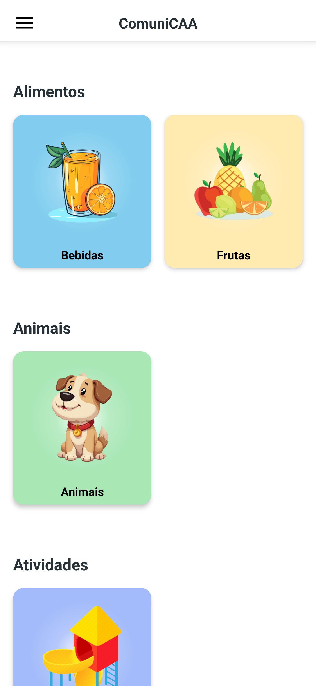
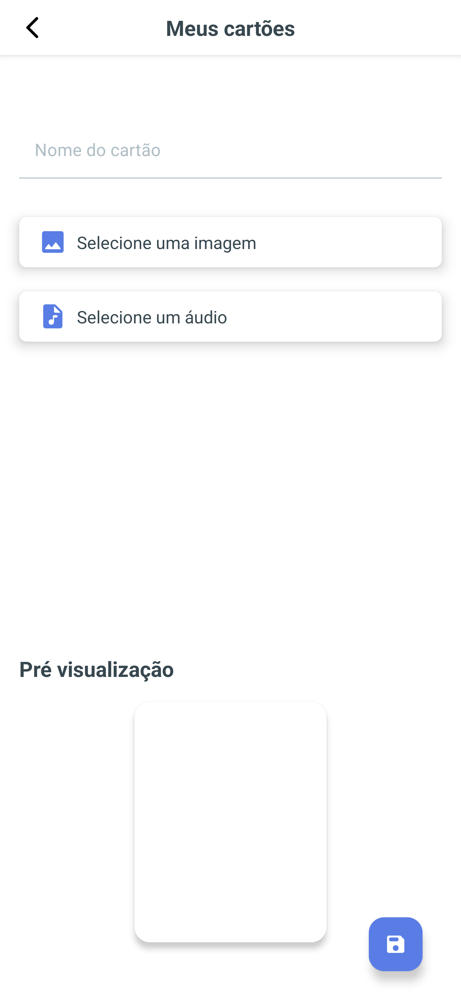
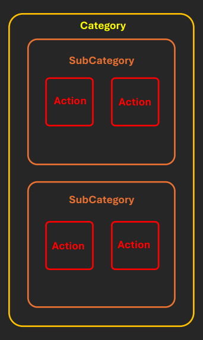

# comunica-cca

App desenvolvido com android nativo e a linguagem Kotlin.

Principais tecnologias:

- [Kotlin - Linguagem de programação](https://kotlinlang.org/)
- [View Binding - Vinculação de visualizações](https://developer.android.com/topic/libraries/view-binding?hl=pt-br)
- [Navigation - Fluxo de navegação](https://developer.android.com/guide/navigation?hl=pt-br)
- [Safe Args - Segurança para trafegar dados entre destinos](https://developer.android.com/guide/navigation/use-graph/safe-args?hl=pt-br)
- [Picasso - Download e visualização de imagens online](https://square.github.io/picasso/)
- [Firebase Storage - Armazenamento de arquivos em nuvem](https://firebase.google.com/docs/storage/android/start?hl=pt-br)
- [Firebase Realtime Database - Armazenamento de dados em nuvem](https://firebase.google.com/docs/database?hl=pt-br)
- [Firebase Authentication - Autenticação de usuários](https://firebase.google.com/docs/auth?hl=pt-br)
- [Preferences Data Store - Armazenamento interno em arquivos chave e valor](https://developer.android.com/topic/libraries/architecture/datastore?hl=pt-br)
- [Hilt - Injeção de dependências](https://developer.android.com/training/dependency-injection/hilt-android?hl=pt-br)
- [LiveData - Dados observáveis com vinculação do ciclo de vida da view](https://developer.android.com/topic/libraries/architecture/livedata?hl=pt-br)

___

## Arquitetura

O Software se baseia
no [guia oficial do Google](https://developer.android.com/topic/architecture?hl=pt-br), que
tecnicamente consiste na divisão de três camadas:

* Visualização
* Domínio
* Dados



### Visualização

A camada de visualização é a responsável por lidar com tudo que diz respeito a interface, desde a
renderização de componentes visuais até lidar com a interação do usuário.
No app esta camada é composta principalmente pelas
views ([Activities](https://developer.android.com/reference/android/app/Activity)
e [Fragments](https://developer.android.com/guide/fragments?hl=pt-br)) e suas respectivas view
models.



Ex: **LoginFragment** e **LoginViewModel** compõem a camada de **Visualização**.

Enquanto o fragment lida com as interações do usuário e com a thread principal, a view model lida
com atualizações de status e as regras de negócio que são fortemente tipadas com a view.

### Domínio

A camada de domínio é opcional e tem o papel de lidar com as regras de negócio do App. Como ela fica
entre as outras duas camadas, o seu objetivo é encapsular as regras de negócio mais complexas e
torna-las simples e reutilizáveis.



No app esta camada é composta por repositórios, por exemplo, a classe **UserRepository** é a
responsável por lidar com as regras de negócio relacionadas ao usuário, como: Login, cadastro e
logout.

### Dados

A camada de dados, de maneira resumida é responsável por realizar conexões e retornar dados, estes
que por sua vez, podem ser internos ou externos.
No app esta camada é composta por:

* **PreferencesHelper**: Dados locais formato chave/valor.
* **RemoteAuth**: Acesso ao serviço de autenticação.
* **RemoteDatabase**: Acesso ao serviço de banco de dados na nuvem.
* **RemoteStorage**: Acesso ao serviço de armazenamento de arquivos na nuvem.



Estas classes foram separadas propositalmente para desacoplar o software dos serviços utilizados.
Por exemplo: Para trocar o serviço de autenticação, basta substituir as operações na classe *
*RemoteAuth**.

___

## Ambiente de desenvolvimento

Foi utilizado a IDE [Android Studio](https://developer.android.com/studio?hl=pt-br) em sua versão *
*Koala** (__17.0.11+1-b1207.30__).

```
Android Studio Koala Feature Drop | 2024.1.2
Build #AI-241.18034.62.2412.12266719, built on August 22, 2024
Runtime version: 17.0.11+1-b1207.30 amd64
```

## Configurações gerais do projeto

Algumas características e configurações importantes para executar o software.

App disponível para dispositivos Android com versão 9.0 (sdk 28) ou superior.

``` 
minSdk = 28     // Android 9
targetSdk = 34  // Android 14
```

Versão do Gradle: 8.7

Versão dos plugins do Gradle: 8.6.0

___

### Estrutura do projeto

O projeto foi estruturado da seguinte maneira:



- base => Classes abstratas utilizadas para base do comportamento do app


- data => Camada de dados
    - preferences_datastore => Serviço de armazenamento interno chave/valor
    - firebase => Contém as classes responsáveis pelos serviços do Firebase
        - auth => Serviço de autenticação do Firebase
        - database => Serviço do banco de dados online do Firebase
        - storage => Serviço de armazenamento do Firebase


- di => Contém os módulos para injeção de dependência do app


- domain => Camada de domínio
    - models => Contém as entidades utilizadas pelo app (data class)
    - repositories => Contém as classes responsáveis por intermediar a camade de apresentação e dados
    - cards => Classe responsável pelos cartões
    - user => Classe responsável pelo usuário


- screen => Camada de apresentação, contém as classes que representam as telas do app


- utils => Funções de extensão e classes para ajudar a na manipulação de dados e lógicas internas

___

### Flavor
Este app possui apenas a flavor "prod".
```
flavorDimensions += "version"
    productFlavors {
        create("prod") {
            dimension = "version"
            resValue("string", "app_name", "ComuniCAA")

            buildConfigField("String", "NAME", "\"ComuniCAA\"")
        }
    }
```

___

### Tipos de builds
Existem dois tipos de builds:
- **prodDebug** = utilize em ambiente de desenvolvimento (aqui as configurações de depuração estão habilitadas e ofuscação de código estão desabilitadas).


- **prodRelease** = utilize para disponibilizar versões testáveis e definitivas para ambiente de produção (configurações de depuração desabilitadas e ofuscação de código habilitada).
```
buildTypes {
        debug {
            isMinifyEnabled = false
            isDebuggable = true
        }

        release {
            isMinifyEnabled = false
            isDebuggable = false
            proguardFiles(
                getDefaultProguardFile("proguard-android-optimize.txt"),
                "proguard-rules.pro"
            )
        }
    }
```

___

## Funcionalidades:

### Login

Realiza a autenticação do usuário a partir do e-mail e senha.
A autenticação do usuário utiliza o serviço de autenticação do Firebase.



___

### Cadastro

Realiza o cadastro do usuário a partir do nome, e-mail e senha.
O cadastro é realizado utilizando o serviço de autenticação do Firebase.



___

### Home

Busca os cartões disponíveis no banco de dados na nuvem (utilizando o serviço de banco de dados do
Firebase).
Além disso, busca os cartões criados pelo usuário e exibe-os abaixo da lista citada acima.



___

### Cartões do usuário

Mostra todos os cartões criados pelo usuário. Ao seleciona é possível excluir ou editar seus dados.


___

### Criar/Editar cartão

Esta tela permite que um novo cartão seja criado ou que um cartão existente seja editado.



___

## Estrutura de dados

No geral foram utilizados 3 models diferentes:
- Model de Categoria
- Model de Subcategoria
- Model de ações



Deste modo pode-se observar que temos várias categorias, onde cada categoria possui várias subcategorias, que por sua vez possuem várias ações.

___

### Categoria:
As categorias ocupam o nível mais alto da hierarquia, ela são as responsáveis pelo contexto das subcategorias e das ações:
```
Categoria - Alimentos
{
  "id": "000001",
  "userId": "",
  "name": "Alimentos",
  "subCategories": [],
  "isDefault": true
}
```

### Subcategoria:
As subcategorias estão logo abaixo das categorias são resopnsáveis pela cor, subtítulo e ainda possuem uma lista de ações:
```
Subcategoria - Frutas
{
  "id": "000010",
  "userId": "",
  "categoryId": "000001",
  "name": "Frutas",
  "image": "https://firebasestorage.googleapis.com/v0/b/comunica-cca.appspot.com/o/default_items_images%2Fcategories%2F000001%2F000010%2Fcomunicaa_fruit_subcategory.png?alt=media&token=2a080939-948c-4202-aaea-f21e076701f0",
  "color": -5456,
  "actions": [],
  "isDefault": true,
}
```

### Ações:
As ações são o útilmo nível da estrutura logo abaixo das subcategorias. Elas possuem uma imagem, título e um arquivo de áudio.
```
{
  "id": "000100",
  "userId": "",
  "categoryId": "000001",
  "subCategoryId": "000010",
  "name": "Banana",
  "image": "Url da imagem",
  "sound": "Url do arquivo de áudio",
  "isDefault": true
}
```

Os identificadores únicos de todas as categorias e subcategorias estão presentes em vários modelos diferentes para possibilitar que o dispositivo final possa realizar o trabalho de processamento que 
é consequência da ausencia de um sistema de backend e servidor dedicados para esta aplicação.

___

## Propostas de Melhorias

Propostas de melhoria e novas funcionalidades para o app.

- Funcionalidade funcionalidade para adicionar, editar e excluir categorias.
- Funcionalidade para adicionar, editar e excluir subcategorias.
- Integrar serviços de autenticação com clientes externos (como o Google, por exemplo).
- Implementar banco de dados local para que o app possa funcionar offline.
- Criar termos de uso e política de privacidade.
- Criar perfil do app na loja (Google Play Console).
- Criar estrutura de backend própria para remover o processamento do telefone e deixar somento no
  servidor.
___